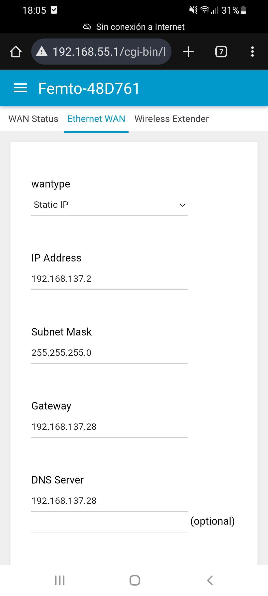

# Configuracion de Gateway IOT Femto.

1. Reiniciar el gateway a valores de fábrica desde el botón que tiene.

2. Una vez reiniciado, entrar al equipo desde su propia red Wifi.

- SSID del Wifi: **AP-48D761**
- Acceder desde el navegador a la ip: **192.168.55.1**
- Usuario: **admin**
- Contraseña: **admin**

Va a pedir un código de provisionamiento, hay dos dependiendo la región:

AS923 – New Zealand/Asia:

`314022001923`

AU915 – Australia:

`AE8722001036`

El dispositivo se reiniciará, cuando esté listo volver a ingresar a la red Wifi (192.168.55.1).

Navegar hasta `Packet Forward → Settings`

En server address poner la dirección IP del servidor local.

Después en Radio 0 y Radio 1 establecer las frecuencias centrales:

`AS923:`\
Radio 0 - Central frequency: **923500000**

Radio 1 - Central frequency: **924300000**

`AU915`\
Radio 0 - Central frequency: **917100000**

Radio 1 - Central frequency: **917900000**
***
**Notas:** *Para reiniciar de fábrica el código de aprovisionamiento sin tener que resetear el equipo con el botón, poner este código y darle a aplicar: `ffff000FE158`*.

*Algunos gateway cambian el EUID al cambiar el modo de funcionamiento, en este caso el código de aprovisionamiento lo hace funcionar como packet forward. En este gateway en específico, en la parte de packet forward, dice arriba “Gateway ID” y da un valor hexa de números y letras, ese es el nuevo valor del EUID, agregar todos ceros adelante hasta completar los 12 caracteres*.
***
En la pc host, a la interfaz Ethernet a la que se vaya a conectar el gateway, hay que darle la dirección IP que pensamos ponerle al servidor. Crear una nueva red, por ej: asignar a la interfaz la dirección ip 192.168.137.28, la red va a ser 192.168.137.0/24. Entonces al gateway hay que darle una dirección ip que pertenezca a esta misma red, por ejemplo 192.168.137.2, en la parte que pide un gateway y un servidor dns ponerle la misma del servidor en ambos (debe ser para conectarse a internet, pero en principio no hace falta que salga a internet). Por defecto el gateway usa la dirección de loopback (127.0.0.1).

También ponerle el puerto 1700 tanto para downlink como para uplink, ya que el servidor está configurado para usar esos puertos (se pueden cambiar desde el docker-compose.yml en caso de querer usar un puerto distinto del 1700).

Una vez hecho todo esto hay que reiniciar el servicio stack desde docker para que haga efecto las configuraciones`(sudo docker restart stack-1, o el nombre que tenga ese docker)`.

En el servidor TTN cuando agregas el gateway va a aparecer en “disconnected” o en “connecting…”, cuando se configura bien el gateway desde su propia interfaz y se reinicia el docker stack, debe aparecer como “connected”, sino aparece así entonces hay algún error, revisar los logs del docker stack para ver que es.

**Fuentes**:

- [iqnexus.com](https://iqnexus.com/knowledge-base/gateways-old/)

- [Femto Gateway Description](https://lora-alliance.org/wp-content/uploads/2020/05/PD_Indoor-Femto-Gateway_20200507-BQW_01_0003.pdf)

- [Femto Gateway User Guide](https://static1.squarespace.com/static/597dc443914e6bed5fd30dcc/t/603d542f205ba224b598052d/1614632013426/UG_IoT+Femto+Gateway.pdf)

- [lora-alliance.com](https://lora-alliance.org/wp-content/uploads/2020/11/lorawan_regional_parameters_v1_0-20161012_1397_1.pdf)

